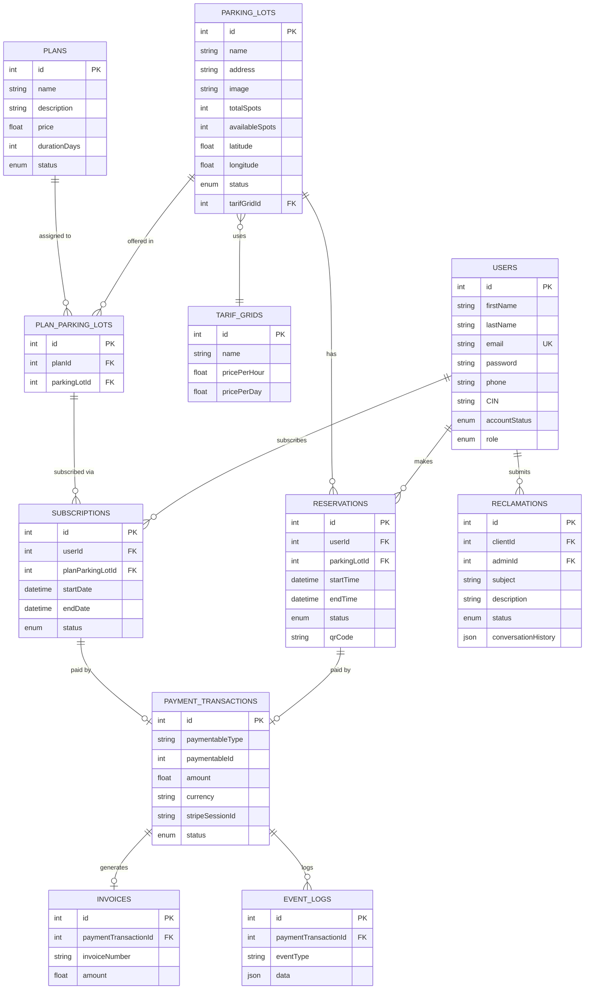

<p align="center">
  <h1 align="center">🅿️ Smart Parking RAG Platform</h1>
  <p align="center">
    <em>An intelligent parking reservation system powered by AI — featuring a full-stack web application with an integrated RAG-based conversational agent.</em>
  </p>
</p>

<p align="center">
  
  
  
  
  
  
</p>

---

## 📑 Table of Contents

- [Overview](#-overview)
- [Architecture](#-architecture)
- [Repositories](#-repositories)
- [Features](#-features)
- [Tech Stack](#-tech-stack)
- [Getting Started](#-getting-started)
  - [Prerequisites](#prerequisites)
  - [1 — Backend API](#1--backend-api-smart-parking-rag-platform)
  - [2 — AI Agent Service](#2--ai-agent-service-ai-parking-agent)
  - [3 — Frontend App](#3--frontend-app-reservationparkingfrontend)
- [Environment Variables](#-environment-variables)
- [Database Schema](#-database-schema)
- [API Reference](#-api-reference)
- [Role-Based Access Control](#-role-based-access-control)
- [Project Structure](#-project-structure)
- [Screenshots](#-screenshots)
- [License](#-license)

---

## 🧭 Overview

**Smart Parking RAG Platform** is a complete parking management solution designed to streamline the reservation, payment, and management of parking spaces. It combines:

- A **RESTful backend API** handling business logic, authentication, payments, and data persistence
- An **AI-powered conversational agent** (RAG — Retrieval-Augmented Generation) that provides intelligent assistance to both clients and administrators
- A **modern React frontend** for intuitive user interaction across all roles

The platform supports three user roles — **Client**, **Admin**, and **Super Admin** — each with tailored interfaces and permissions.

---

## 🏗 Architecture

```
┌─────────────────────────────────────────────────────────────────┐
│                        CLIENT BROWSER                           │
│                    React + Vite + Tailwind                       │
│              (ReservationParkingFrontEnd)                        │
└──────────────────────┬──────────────────────────────────────────┘
                       │ HTTP (REST API)
                       ▼
┌─────────────────────────────────────────────────────────────────┐
│                      BACKEND API SERVER                         │
│              Node.js + Express 5 + TypeScript                   │
│               (smart-parking-rag-platform)                      │
│                                                                 │
│  ┌──────────┐ ┌───────────┐ ┌──────────┐ ┌──────────────────┐  │
│  │   Auth   │ │  Parking  │ │ Payments │ │   Reclamations   │  │
│  │  (JWT)   │ │   CRUD    │ │ (Stripe) │ │   + AI Agent     │  │
│  └──────────┘ └───────────┘ └──────────┘ └────────┬─────────┘  │
│                                                    │            │
└────────────────────┬───────────────────────────────┼────────────┘
                     │                               │
                     ▼                               ▼
          ┌──────────────────┐           ┌───────────────────────┐
          │     MySQL DB     │           │   AI Agent Service    │
          │   (Sequelize)    │           │  FastAPI + Python     │
          │                  │           │  (ai-parking-agent)   │
          │  • Users         │           │                       │
          │  • Reservations  │           │  • RAG Pipeline       │
          │  • Parking Lots  │           │  • Vector Store       │
          │  • Payments      │           │  • LLM Integration    │
          │  • Subscriptions │           │  • Document Upload    │
          │  • Plans         │           └───────────┬───────────┘
          │  • Reclamations  │                       │
          │  • Invoices      │                       ▼
          └──────────────────┘           ┌───────────────────────┐
                                         │   Mysql / ChromaDB  │
                                         │   (Vector Store)      │
                                         └───────────────────────┘
```

---

## 📦 Repositories

| Repository | Description | Tech |
|:-----------|:------------|:-----|
| [**smart-parking-rag-platform**](https://github.com/Makrem41298/smart-parking-rag-platform) | Backend REST API — business logic, auth, payments, DB | Node.js, Express 5, TypeScript, Sequelize, MySQL |
| [**ai-parking-agent**](https://github.com/Makrem41298/ai-parking-agent) | AI conversational agent microservice — RAG pipeline | Python, FastAPI, LangChain, ChromaDB |
| [**ReservationParkingFrontEnd**](https://github.com/Makrem41298/ReservationParkingFrontEnd) | Frontend SPA — dashboards, reservations, chatbot UI | React, Vite, Tailwind CSS, JavaScript |

---

## ✨ Features

### 🔐 Authentication & Authorization
- JWT-based authentication with token refresh
- Role-based access control (Client, Admin, Super Admin)
- Secure password hashing with bcrypt
- Profile management & password change

### 🅿️ Parking Management
- Full CRUD for parking lots with image uploads
- Real-time availability tracking
- Tariff grid configuration (per-hour/per-day pricing)
- Parking status management (Open, Closed, Maintenance, Full)

### 📅 Reservation System
- Create, view, update, and cancel reservations
- QR code generation for check-in
- Status lifecycle: Pending → Confirmed → Checked In → Completed
- Automatic expiration handling & no-show detection

### 💳 Payments (Stripe Integration)
- Stripe Checkout sessions for secure payment
- Webhook-based payment confirmation
- Refund request workflow (request → approve/reject)
- Full transaction history with event logging
- Invoice generation

### 📋 Subscription & Plans
- Flexible subscription plans per parking lot
- Plan assignment to specific parking locations
- Subscription lifecycle management (Active, Suspended, Expired, Canceled)

### 📝 Reclamation System
- Clients can submit complaints/reclamations
- Admin can manage and respond to reclamations
- AI-assisted reply generation for admins
- Conversation history tracking

### 🤖 AI Agent (RAG-Powered Chatbot)
- **Admin Agent** — assists admins in handling reclamations with context-aware responses
- **Client Agent** — helps clients with parking info, reservations, and FAQs
- **Anonymous Agent** — public chatbot for unauthenticated users (general parking info)
- RAG pipeline: documents are uploaded, embedded, and stored in a vector database
- Super Admin can manage knowledge base files (upload, download, delete)
- Vector store status monitoring

### 👤 User Management
- Admin can view and manage all users
- Super Admin can create admin accounts
- Account status management (Active, Pending, Suspended, Blocked)

---

## 🛠 Tech Stack

### Backend API
| Technology | Purpose |
|:-----------|:--------|
| **Node.js** | Runtime environment |
| **Express 5** | Web framework |
| **TypeScript** | Type-safe development |
| **Sequelize 6** | ORM for MySQL |
| **MySQL** | Relational database |
| **JWT** | Authentication tokens |
| **bcrypt** | Password hashing |
| **Stripe SDK** | Payment processing |
| **Multer** | File upload handling |
| **QRCode** | QR code generation |
| **Axios** | HTTP client (agent communication) |

### AI Agent
| Technology | Purpose |
|:-----------|:--------|
| **Python** | Runtime |
| **FastAPI** | API framework |
| **LangChain** | AI orchestration |
| **ChromaDB / MongoDB** | Vector store |
| **Jupyter Notebook** | Experimentation & prototyping |

### Frontend
| Technology | Purpose |
|:-----------|:--------|
| **React** | UI library |
| **Vite** | Build tool & dev server |
| **Tailwind CSS** | Utility-first CSS framework |
| **JavaScript** | Language |

---

## 🚀 Getting Started

### Prerequisites

- **Node.js** ≥ 18.x
- **Python** ≥ 3.10
- **MySQL** ≥ 8.0
- **npm** or **yarn**
- **uv** (Python package manager, for the agent)
- **Stripe account** (for payment testing)

---

### 1 — Backend API (`smart-parking-rag-platform`)

```bash
# Clone the repository
git clone https://github.com/Makrem41298/smart-parking-rag-platform.git
cd smart-parking-rag-platform

# Install dependencies
npm install

# Create and configure .env file
cp .env.example .env
# Edit .env with your database credentials (see Environment Variables section)

# Create MySQL database
mysql -u root -p -e "CREATE DATABASE parking;"

# Start the development server
npm run dev
```

The backend server runs at **http://localhost:3000** by default.

---

### 2 — AI Agent Service (`ai-parking-agent`)

```bash
# Clone the repository
git clone https://github.com/Makrem41298/ai-parking-agent.git
cd ai-parking-agent

# Install dependencies with uv
uv sync

# Start the FastAPI server
uv run uvicorn main:app --reload --host 0.0.0.0 --port 8000
```

The agent service runs at **http://localhost:8000** by default.

---

### 3 — Frontend App (`ReservationParkingFrontEnd`)

```bash
# Clone the repository
git clone https://github.com/Makrem41298/ReservationParkingFrontEnd.git
cd ReservationParkingFrontEnd

# Install dependencies
npm install

# Start the development server
npm run dev
```

The frontend runs at **http://localhost:5173** by default.

---

## 🔧 Environment Variables

Create a `.env` file in the backend root directory:

```env
# ── Application ──────────────────────────
NODE_ENV=development
PORT=3000

# ── JWT ──────────────────────────────────
JWT_SECRET=your_jwt_secret_key_here

# ── Database (MySQL) ─────────────────────
DB_DIALECT=mysql
DB_NAME=parking
DB_USER=root
DB_PASSWORD=your_password
DB_HOST=127.0.0.1
DB_PORT=3306

# ── AI Agent Service ─────────────────────
AGENT_SERVICE_URL=http://127.0.0.1:8000

# ── Frontend URL (CORS) ─────────────────
FRONT_URL=http://localhost:5173
FRONTEND_URL=http://localhost:5173

# ── Stripe (Payments) ───────────────────
STRIPE_SECRET_KEY=sk_test_xxx
STRIPE_WEBHOOK_SECRET=whsec_xxx
```

---

## 🗄 Database Schema



---

## 📡 API Reference

> Base URL: `http://localhost:3000`

### 🔐 Authentication
| Method | Endpoint | Description | Auth |
|:-------|:---------|:------------|:-----|
| `POST` | `/register` | Register a new user | ❌ |
| `POST` | `/login` | Login and get JWT | ❌ |
| `POST` | `/refresh` | Refresh access token | 🔒 |
| `POST` | `/logout` | Logout user | 🔒 |
| `GET` | `/profile` | Get current user profile | 🔒 |
| `PUT` | `/change-password` | Change password | 🔒 |

### 👤 Users
| Method | Endpoint | Description | Auth |
|:-------|:---------|:------------|:-----|
| `GET` | `/users` | List all users | 🔒 Admin |
| `GET` | `/users/:id` | Get user by ID | 🔒 Admin |
| `PUT` | `/users/:id` | Update user | 🔒 Admin |
| `POST` | `/users` | Create an admin account | 🔒 Super Admin |

### 🅿️ Parking Lots
| Method | Endpoint | Description | Auth |
|:-------|:---------|:------------|:-----|
| `GET` | `/parking-lot` | List all parking lots | ❌ |
| `GET` | `/parking-lot/:id` | Get parking lot details | ❌ |
| `POST` | `/parking-lot` | Create a parking lot | 🔒 Admin |
| `PUT` | `/parking-lot/:id` | Update a parking lot | 🔒 Admin |
| `DELETE` | `/parking-lot/:id` | Delete a parking lot | 🔒 Admin |

### 💰 Tariff Grids
| Method | Endpoint | Description | Auth |
|:-------|:---------|:------------|:-----|
| `GET` | `/tarif-grid` | List all tariff grids | ❌ |
| `GET` | `/tarif-grid/:id` | Get tariff grid by ID | ❌ |
| `POST` | `/tarif-grid` | Create a tariff grid | 🔒 Admin |
| `PUT` | `/tarif-grid/:id` | Update a tariff grid | 🔒 Admin |
| `DELETE` | `/tarif-grid/:id` | Delete a tariff grid | 🔒 Admin |

### 📅 Reservations
| Method | Endpoint | Description | Auth |
|:-------|:---------|:------------|:-----|
| `GET` | `/reservations` | List reservations | 🔒 |
| `GET` | `/reservations/:id` | Get reservation details | 🔒 |
| `POST` | `/reservations` | Create a reservation | 🔒 Client |
| `PUT` | `/reservations/:id` | Update reservation status | 🔒 |

### 📋 Plans
| Method | Endpoint | Description | Auth |
|:-------|:---------|:------------|:-----|
| `GET` | `/plans` | List all plans | ❌ |
| `GET` | `/plans/:id` | Get plan by ID | ❌ |
| `POST` | `/plans` | Create a plan | 🔒 Admin |
| `PUT` | `/plans/:id` | Update a plan | 🔒 Admin |
| `DELETE` | `/plans/:id` | Delete a plan | 🔒 Admin |

### 🔗 Plan ↔ Parking Lot
| Method | Endpoint | Description | Auth |
|:-------|:---------|:------------|:-----|
| `GET` | `/plan-parking-lot` | List all associations | ❌ |
| `GET` | `/plan-parking-lot/:id` | Get association by ID | ❌ |
| `POST` | `/plan-parking-lot` | Create association | 🔒 Admin |
| `PUT` | `/plan-parking-lot/:id` | Update association | 🔒 Admin |
| `DELETE` | `/plan-parking-lot/:id` | Delete association | 🔒 Admin |

### 📦 Subscriptions
| Method | Endpoint | Description | Auth |
|:-------|:---------|:------------|:-----|
| `GET` | `/subscriptions` | List subscriptions | 🔒 |
| `GET` | `/subscriptions/:id` | Get subscription details | 🔒 |
| `POST` | `/subscriptions` | Create a subscription | 🔒 Client |
| `PUT` | `/subscriptions/:id` | Update subscription | 🔒 |

### 💳 Payments
| Method | Endpoint | Description | Auth |
|:-------|:---------|:------------|:-----|
| `POST` | `/create-checkout-session` | Create Stripe checkout | 🔒 |
| `POST` | `/api/stripe/webhook` | Stripe webhook handler | ❌ (Stripe) |
| `GET` | `/payments/reservation/:id` | Get payment by reservation | 🔒 |
| `GET` | `/transactions` | List all transactions | 🔒 |
| `GET` | `/transactions/:id` | Get transaction details | 🔒 |
| `POST` | `/transactions/:id/refund-request` | Request a refund | 🔒 |
| `POST` | `/transactions/:id/refund-approve` | Approve refund | 🔒 Admin |
| `POST` | `/transactions/:id/refund-reject` | Reject refund | 🔒 Admin |

### 📝 Reclamations
| Method | Endpoint | Description | Auth |
|:-------|:---------|:------------|:-----|
| `GET` | `/reclamations` | List all reclamations | 🔒 |
| `GET` | `/reclamation/:id` | Get reclamation details | 🔒 |
| `POST` | `/reclamation` | Submit a reclamation | 🔒 Client |
| `PUT` | `/reclamation/:id` | Update reclamation | 🔒 |
| `DELETE` | `/reclamation/:id` | Delete reclamation | 🔒 |

### 🤖 AI Agent
| Method | Endpoint | Description | Auth |
|:-------|:---------|:------------|:-----|
| `POST` | `/agent` | Admin agent (reclamation context) | 🔒 Admin |
| `POST` | `/agent-client` | Client chatbot | 🔒 Client |
| `POST` | `/agent-anonymous` | Public chatbot (no auth) | ❌ |
| `POST` | `/upload` | Upload documents to knowledge base | 🔒 Super Admin |
| `GET` | `/files` | List uploaded files | 🔒 Super Admin |
| `POST` | `/files/delete-batch` | Batch delete files | 🔒 Super Admin |
| `GET` | `/files/:filename/download` | Download a file | 🔒 Super Admin |
| `GET` | `/vectorstore/status` | Get vector store status | 🔒 Super Admin |

---

## 🛡 Role-Based Access Control

| Feature | Client | Admin | Super Admin |
|:--------|:------:|:-----:|:-----------:|
| Register / Login | ✅ | ✅ | ✅ |
| View parking lots | ✅ | ✅ | ✅ |
| Create reservations | ✅ | ❌ | ❌ |
| Create subscriptions | ✅ | ❌ | ❌ |
| Submit reclamations | ✅ | ❌ | ❌ |
| Use client chatbot | ✅ | ❌ | ❌ |
| Manage parking lots | ❌ | ✅ | ✅ |
| Manage plans & tariffs | ❌ | ✅ | ✅ |
| Handle reclamations | ❌ | ✅ | ✅ |
| Use admin AI agent | ❌ | ✅ | ✅ |
| Approve/reject refunds | ❌ | ✅ | ✅ |
| Manage users | ❌ | ✅ | ✅ |
| Create admin accounts | ❌ | ❌ | ✅ |
| Manage knowledge base | ❌ | ❌ | ✅ |
| View vector store status | ❌ | ❌ | ✅ |

---

## 📂 Project Structure

### Backend (`smart-parking-rag-platform`)

```
smart-parking-rag-platform/
├── app.ts                    # Application entry point
├── package.json              # Dependencies & scripts
├── tsconfig.json             # TypeScript configuration
├── .sequelizerc              # Sequelize CLI configuration
├── config/
│   ├── config.js             # Database configuration
│   └── stripe.ts             # Stripe initialization
├── controllers/
│   ├── auth.controller.ts    # Authentication logic
│   ├── user.controller.ts    # User management
│   ├── parkingLot.controller.ts
│   ├── reservation.controller.ts
│   ├── payment.controller.ts # Stripe integration
│   ├── plan.controller.ts
│   ├── planParkingLot.controller.ts
│   ├── subscription.controller.ts
│   ├── tarifGrid.controller.ts
│   ├── reclamation.controller.ts
│   └── agent.controller.ts   # AI agent proxy
├── middlewares/
│   ├── auth.middleware.ts     # JWT verification
│   └── role.middleware.ts     # Role-based guard
├── models/
│   ├── index.ts              # Sequelize init & associations
│   ├── enum.type.ts          # Enum definitions
│   ├── user.model.ts
│   ├── parkingLot.model.ts
│   ├── reservation.model.ts
│   ├── paymentTransaction.model.ts
│   ├── invoice.model.ts
│   ├── eventLog.model.ts
│   ├── plan.model.ts
│   ├── planParkingLot.model.ts
│   ├── subscription.model.ts
│   ├── tarifGrid.model.ts
│   └── reclamation.model.ts
├── routes/
│   └── api.ts                # All route definitions
├── database/                 # Migrations & seeders
└── uploads/                  # Uploaded files (parking images)
```

### AI Agent (`ai-parking-agent`)

```
ai-parking-agent/
├── main.py                   # FastAPI entry point
├── pyproject.toml            # Python project config (uv)
├── uv.lock                   # Dependency lock file
├── agent/                    # Agent logic & prompts
├── auth/                     # Token verification
├── database/                 # DB connections
├── models/                   # Pydantic models
├── routes/                   # API routes
├── schemas/                  # Request/response schemas
└── services/                 # Business logic services
```

### Frontend (`ReservationParkingFrontEnd`)

```
ReservationParkingFrontEnd/
├── index.html                # Entry HTML
├── package.json              # Dependencies & scripts
├── vite.config.js            # Vite configuration
├── tailwind.config.js        # Tailwind CSS config
├── postcss.config.js         # PostCSS config
├── eslint.config.js          # ESLint config
├── public/                   # Static assets
└── src/                      # React source code
```

---


## 📄 License

This project is developed as part of an engineering internship project.

---

<p align="center">
  <strong>Built with ❤️ by <a href="https://github.com/Makrem41298">Makrem</a></strong>
</p>
